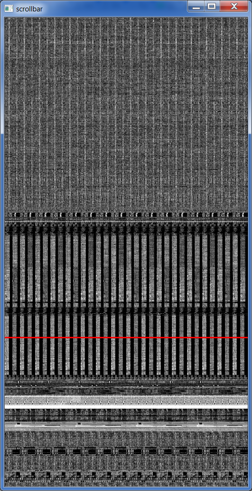
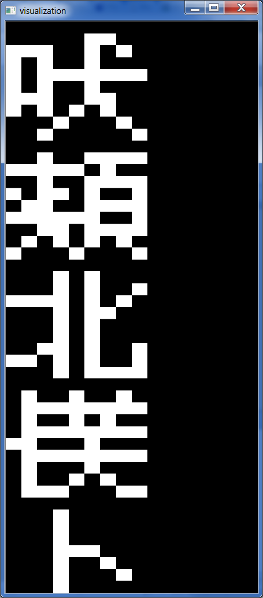

# binmap

displays the bits in any file. good for sifting through firmware files that might contain bitmap pictures or fonts.

## usage

binmap.py inputfile

## interface

both windows accept keyboard input.

the scrollbar shows a 256px wide preview and a frame around the pixels that are drawn aligned in the bitmap window.

* ESC exits.
* Ctrl-D does a hexdump.
* w<decimal> sets bitmap width
* h<decimal> sets bitmap height / scrollbar window
* g<hex> jumps to this byte in the file
* arrow keys shift the bitmap
* pgup/pgdn jumps by one window size

### scrollbar

left drag to move window.

scroll to resize window.

right click/drag to jump to pointer.

### bitmap

left drag to shift up/down/left/right.

scroll to change width.

